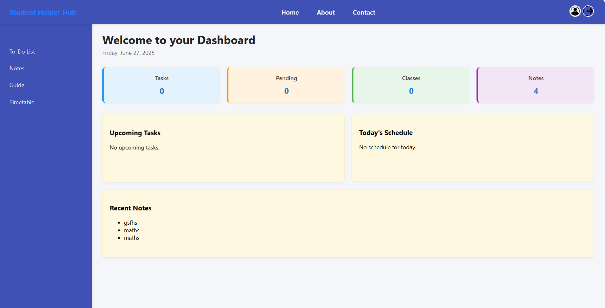
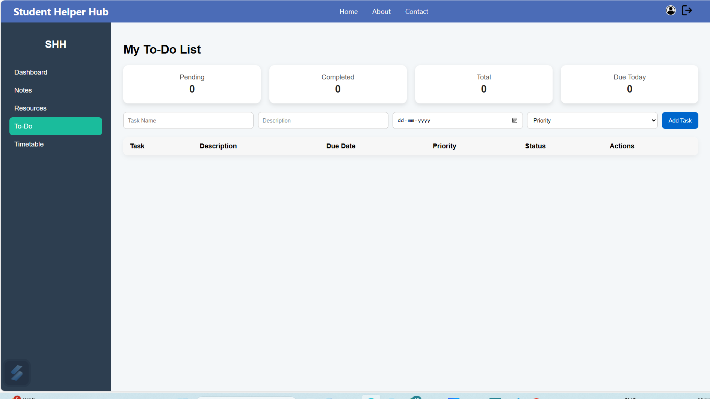
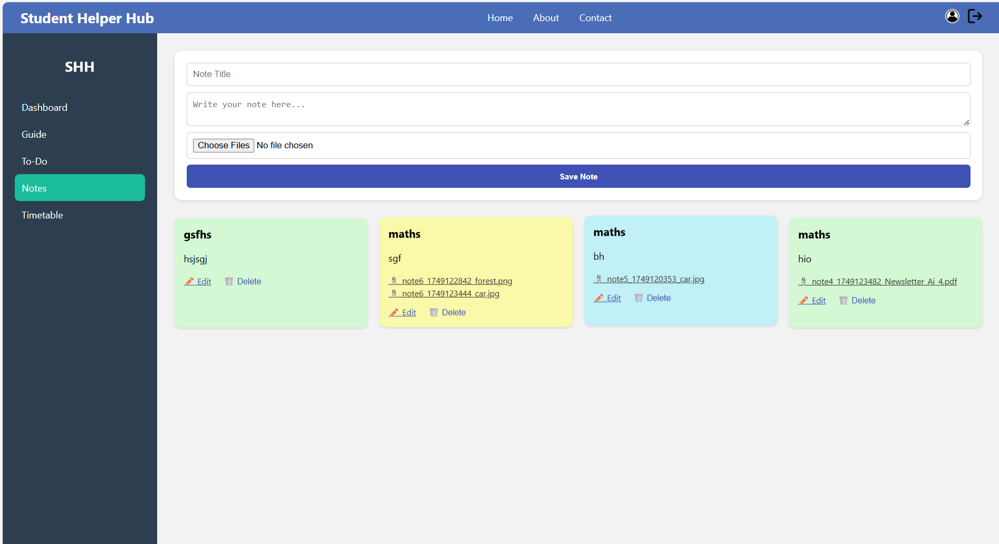
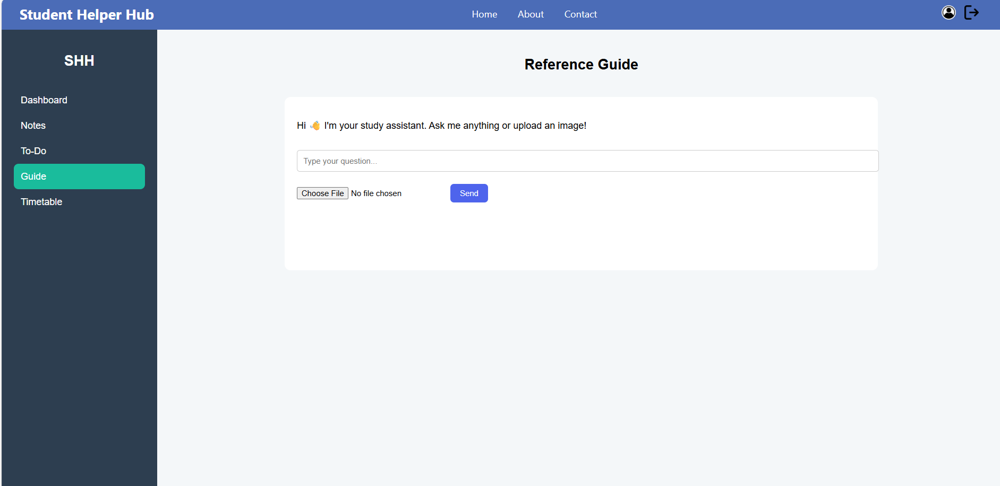
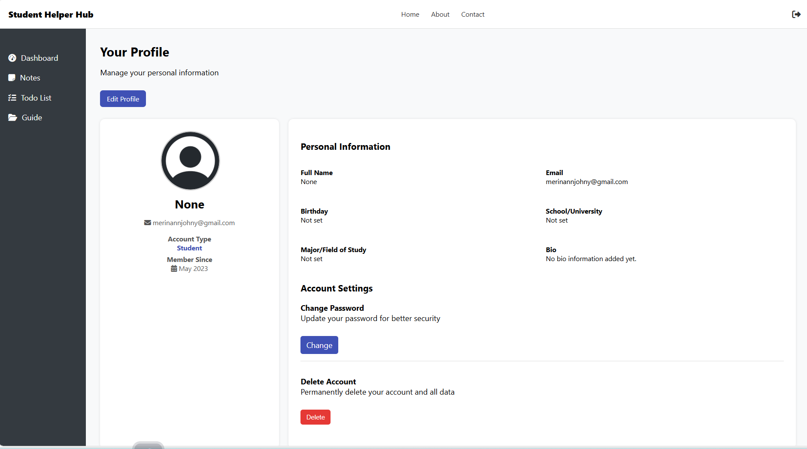
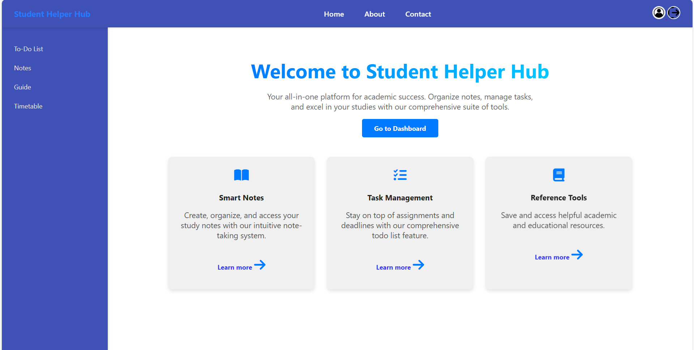

#🎓 Student Helper Hub

A full-featured productivity platform built with Flask to help students manage their academic life — all in one place.

[🚀 Live Demo »](https://student-helper-hub.onrender.com)

---

 ✨ Features

- 🏠 Dashboard with summaries: Tasks, Notes, Today's Classes, Upcoming Tasks
- 📝 Notes with file uploads and inline editing
- ✅ To-Do Listwith priority levels, due reminders, and task stats
- 🧠 AI Study Assistant powered by Gemini (text + image input)
- 🗓️ Timetable with file attachments and color-coded class blocks
- 📁 Resources :Guide
- 👤 User Profilewith photo upload, edit/delete, and info panel
- 🔐 Authentication: Register, Login, Forgot & Reset Password
- 📬 Contact Form*:with email delivery

---

🖼️ Preview

> Click any image below to view the live app

[](https://student-helper-hub.onrender.com)
[](https://student-helper-hub.onrender.com)
[](https://student-helper-hub.onrender.com)
[](https://student-helper-hub.onrender.com)
[](https://student-helper-hub.onrender.com)
[](https://student-helper-hub.onrender.com)
[](https://student-helper-hub.onrender.com)
[](https://student-helper-hub.onrender.com)
[](https://student-helper-hub.onrender.com)
[](https://student-helper-hub.onrender.com)
[](https://student-helper-hub.onrender.com)

---

 📦 Tech Stack

- Backend**: Flask, SQLite
- Frontend: HTML, CSS, JS (Vanilla)
- AI Integration: Gemini 1.5 via Google GenerativeAI
- Deployment: Render
- Email: Flask-Mail

---

⚙️ Setup Instructions (Local)

1. Clone the repo:
   ```bash
   git clone https://github.com/MerinJohnyMaippan/student-helper-hub.git
   cd student-helper-hub
