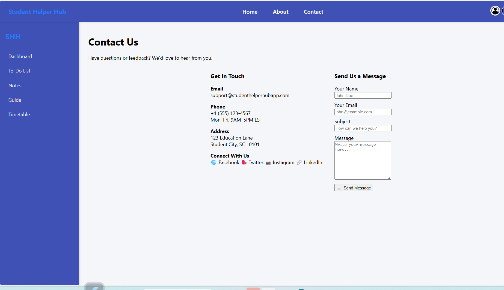

# 🎓 Student Helper Hub

A full-featured productivity platform built with Flask to help students organize their academic life — all in one place.

---

## 🚀 Features

- 🏠 **Dashboard** with summaries: Total Tasks, Notes, Today's Classes, Upcoming Tasks
- 📝 **Notes** with file attachments and edit/delete
- ✅ **To-Do List** with priority, summary stats, and due reminders
- 🧠 **AI Study Assistant** powered by Gemini (text + image support)
- 🗓️ **Timetable** with color-coded schedules and file support
- 📁 **Resources** 
- 👤 **User Profile** with profile photo upload/edit/delete
- 🔐 **Authentication**: Register, Login, Forgot & Reset Password
- 📬 **Contact Form** (sends email to admin)


---

## 🖼️ Preview

> _Screenshots or video demo here (optional)_  
> You can add images to a `screenshots/` folder and link them like this:

```markdown
[](https://student-helper-hub.onrender.com)
[](https://student-helper-hub.onrender.com)
[](https://student-helper-hub.onrender.com)
[](https://student-helper-hub.onrender.com)
[](https://student-helper-hub.onrender.com)
[](https://student-helper-hub.onrender.com)
[](https://student-helper-hub.onrender.com)
[](https://student-helper-hub.onrender.com)
[](https://student-helper-hub.onrender.com)
[](https://student-helper-hub.onrender.com)
[](https://student-helper-hub.onrender.com)

